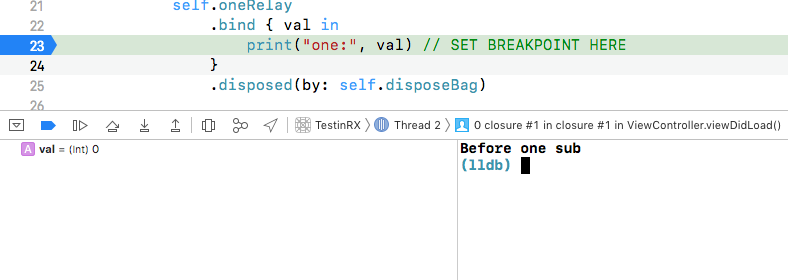

# ReactiveX/RxSwift BehaviorRelay doesn't guarantee that emission happens on the main thread

The code snippet is located in the ViewController.swift and is run with a breakpoint set to a line that says SET BREAKPOINT HERE.

On the first screenshot we have to note that a subscription is being created and the oneRelay instantly emits it's current value to the observer. Since we create the subscription from a global concurrent queue and there is no way on runtime for RxSwift to check the queue we are executing on, it has nothing left to do other than running the emission code synchronously on the same queue. Hence, the observer get the event in the same synchronous execution context to one that was used to create the subscription in the first place. NB: degugger says `Thread 2`.

On the second screenshot there is an event accepted on the global queue and observer being run on the same global queue (`Thread 4`). 

And here the event was `DispatchQueue.main.async`'ed and the debugger shows that the observer is run on `Thread 1` hence main queue.

